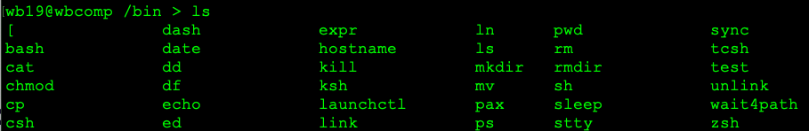
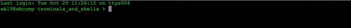
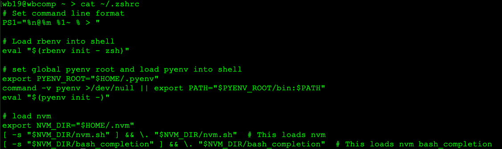

# Terminals and Shell programs

### Learning Goals
- What is the terminal program?
- What is a shell program? (Bash, zsh, fish)
- How do the two work together?
- How configuration files work (.bashrc, .zshrc, .vimrc)
- What are shell environment variables ($USER, $PATH)
- What does adding to the PATH mean, and how is it done, and why is it useful?

## The Terminal

The terminal is the entry point to our demo. The terminal provides an application space for us to be able to
interact with out computer. The terminal's job is to load and run a shell program, like one of the several
listed above (zsh, bash, fish). These shell programs are called shells, because they 'wrap around' the terminal
in a way, allowing us to interact with the terminal. Before we had our fancy graphical user interface (GUI)
computers, everyone that wanted to use a computer was forced to use the terminal, or command line. Now that we
regularly use the mouse, shell programs aren't nearly as commonly used as they once were. As a software
developer, you will find the terminal to be the most effective way to write programs and develop software.

## Shell Programs

A shell program provides all of the functionality you are used to while using the terminal. This program,
at its most basic level, provides a prompt for the user to input commands, and each one is processed as it
is received. The command from the user could be a program, like `ls` or `cd`. Both of these 'commands' are 
actually programs that we call upon to do their jobs. 

> Figure 1: The shell program used by macOS by default is zsh. This program, along with bash (a very popular shell)
are both stored in a folder called bin, which itself lies in the root folder of the operating system. Other
programs you may recognize here are `ls`, `cd`, `mkdir`, amongst others. There programs are provided by the
operating system, so they will work from the moment you start your computer for the first time.

Now, we can see how the terminal and a shell program interact with each other. The terminal allows for a place
for anything to happen, like an empty canvas when beginning to paint something. The paintbrush and paint are 
the shell, which in turn allow you to create whatever you wish. 

## Configuration files (not so bad)

Configuration files are what allow you, the user, to specify to your shell program everything it needs to 
start up. These files, usually ending in `rc`, only run when the shell program is started. You can actually
observe this process in real time. Go ahead and open a terminal window or tab. You will see a moment of hesistation
from the terminal before the input prompt appears. If your machine is too quick, take a look at mine below.

> Figure 2: The terminal pauses for a moment before presenting the input prompt. This is the shell program
loading the configuration file before giving the user control.

Before we continue, we need to check which shell program your terminal uses when you open the terminal. To check
this, use the echo program (it's in that picture above as well!) to check with the command:

`echo $SHELL`

Echo takes a single argument, and echos back what it came up with. In this case, we want more information on a
environment variable named SHELL. The shell program knows to consider SHELL as a enviornment variable because
of the dollar sign at the beginning. The response from echo will let you know which shell you are using. It will
likely be `zsh` if you are using macOS, and `bash` if you are using Linux/WSL. They are both very similar,
especially within the context of our discussion today. More information about environment variables later on
in the README.

### A quick aside about file names

Something to note, is that these configuration files do not have the file extension `.rc`. The file name simply ends with the characters
'rc'. Another interesting thing to note about these files is that they begin with a period. On Unix-like 
systems (macOS and WSL/Linux), a file beginning with a period means that file is hidden to the user by default.
It can be exposed by checking the 'show hidden files and folders' setting for your file explorer, or they can
be viewed with `ls` by passing the flag `-a`, which stands for 'all'. So `ls -a` will show both regular and
hidden folders and files.

Tangent aside, the filename `.zshrc` or `.bashrc` should now make sense. Lastly, the configuration files live
in your main user folder. This can be accessed via the command line: `~/`, where the tilde character represents
the current user (you). That means, on my computer, these two lines are exactly the same:

> ~/Developer

is the same place in the file system as

> /Users/wb19/Developer

The first option is much less typing, and will only be worse depending on your user name. A quick way to see your
configuration file is to use the `cat` program. Cat allows us to print a file's text in our terminal. Let's print
the configuration file for my zsh shell. 

`cat ~/.zshrc`

or

`cat ~/.zshrc`

depending on if you are using bash or zsh. Going forward, you can replace the word bash or zsh with each other
as you see fit. I will be using zsh, but regardless, I will be explicit when the commands between
zsh and bash diverge.

### Contents of the rc file

Your rc file represents how your shell gets ready before starting. Because each person's computer is different,
mine will look different than yours. It should look similar, but not the same. Here's mine:

> Figure 3: An example of an rc file with several different defined processes. The first line, beginning with
`PS1`, specifies the format of the input prompt. You can customize it by changing the string to which it is
assigned. 

Each of these blocks of code does something before the shell is started, and we can start inputting commands.
The first sets the input prompt format. The second loads loads a ruby version manager called `rbenv`, so that
I can call upon it anywhere when using the command line. Similarly with the third and fourth blocks, both
pyenv (python equivelant to rbenv) and nvm (node equivelant to rbenv) are loaded as well. 

### Environment Variables

In each of these blocks, several instances of the phrase 'export CAPITAL_WORD' can be seen. This is how you 
can define environment variables. Environment variables, in the context of a shell program, are just variables
that can be accessed from any place in your file system. Often times, the shell itself uses the variables to complete the user's
request. If you have ever encountered a situation where the solution was adding something to your PATH, this
is what it was referencing. If you include a certain directory in your PATH, zsh will look there in order to 
carry out your command. Here's an example.

The goal of our example is this. We type `say_hi` in the shell input prompt, and 'hello, world!' is printed
to the screen. Not a very complicated or useful program, but if you type `say_hi` in your terminal now,
it will report back that it isn't sure what you mean. By understanding how to define custom commands, like 
`say_hi`, you can make much more sophisticated scripts to help you do your job!

